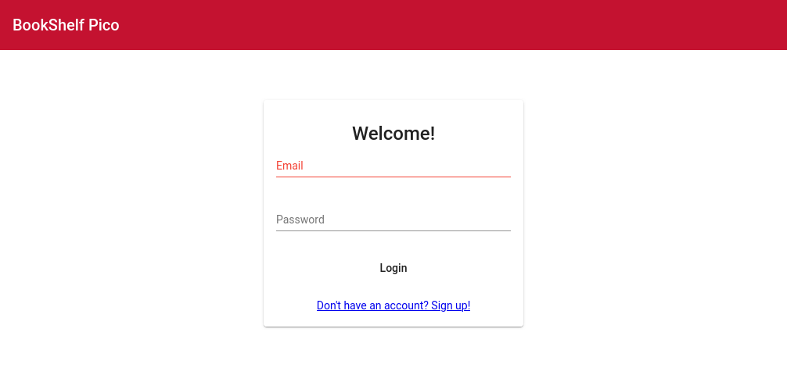
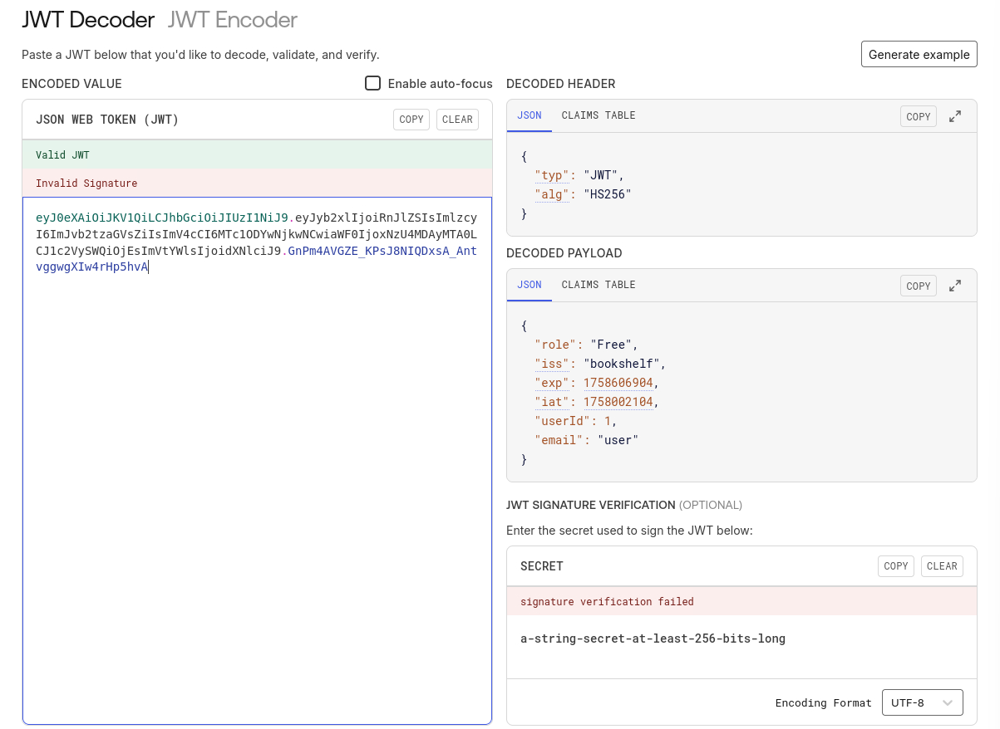
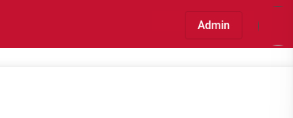
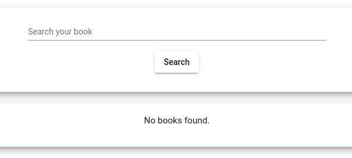
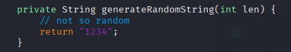
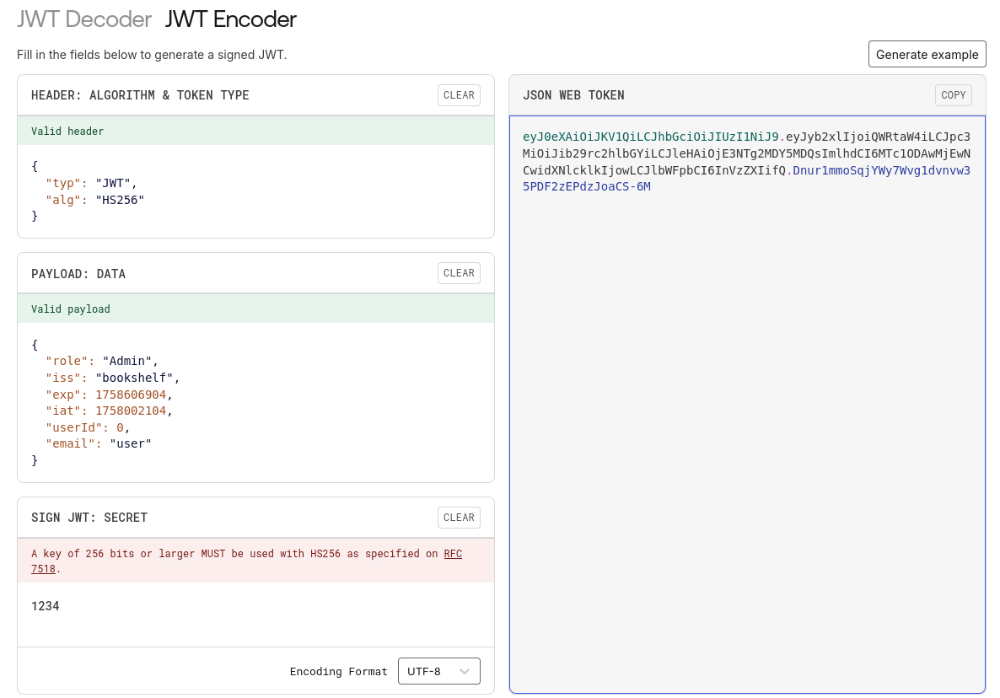

## 題目資訊

- 來源：picoCTF2023
- 分類：Web Exploitation
- 難度：中

## 解題流程

先用題目給的帳號密碼登入



登入後，下面就會有特定身分才能開的書，其中一個就是 flag


因為網頁本身沒有特別的東西

往後看 cookie、local storage 和 session storage

- local storage 存了兩個值，分別是 auth-token 和 token-payload
- token 解開就是 payload 的值，如下圖



提示說 role 跟 userId 可能有有趣的東西

直接把 role 改成 `Admin`，userId 改成 `0`

會發現使用者名稱換了，然後頭像找不到



如果直接改 token 畫面就沒東西，看來也會驗證簽章



好吧，轉頭找原始碼…

提示說 controllers, services 和 security 值得注意

翻一下有個產生 secret 的片段在 `/src/main/java/io/github/nandandesai/pico/security/SecretGenerator.java`



所以 secret 就直接是 1234

把 secret 改成 1234 再寫回去



可能是 ID 不對


往後加一試試看

```json
{
  "role": "Admin",
  "iss": "bookshelf",
  "exp": 1758608302,
  "iat": 1758003502,
  "userId": 2,
  "email": "user"
}
```

## FLAG

> picoCTF{w34k_jwt_n0t_g00d_d7c2e335}

記得 auth-token 和 token-payload 都要改
