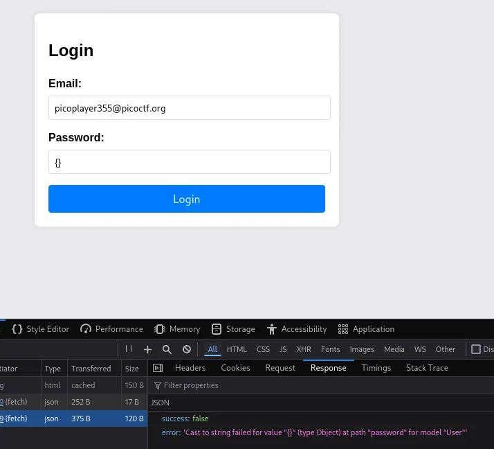
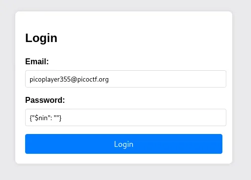
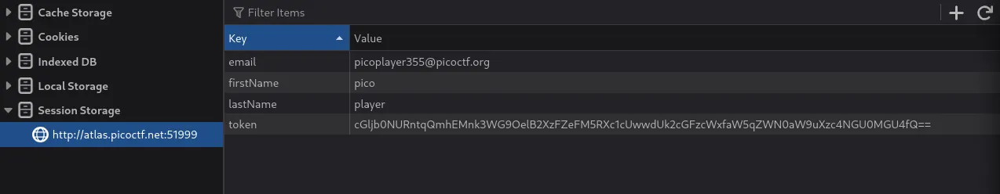
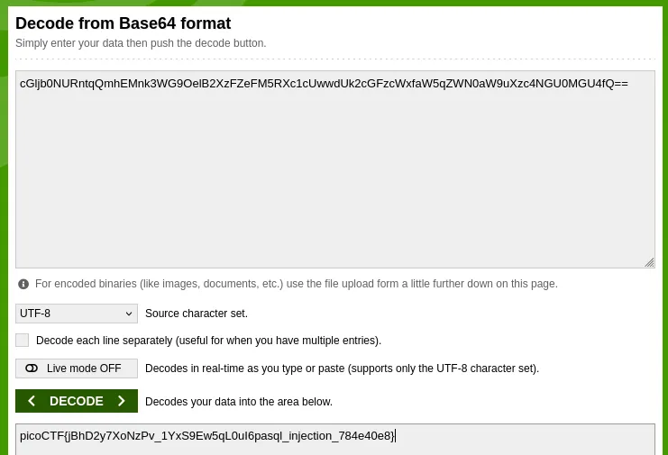

## 題目資訊

- 來源：picoCTF2024
- 分類：Web Exploitation
- 難度：中

## 解題流程

### 探勘

先解壓題目的檔案，有一些 HTML 跟 JS

在`index.html`裡，如果登入成功，會印出回傳資料，並寫入 sessionStorge

在`server.js`裡，有初始使用者的資料會在伺服器啟動時被新增，但密碼可能猜不到

```jsx{linenos=true, hl_lines=[5,6]}
// Store initial user
const initialUser = new User({
  firstName: 'pico',
  lastName: 'player',
  email: 'picoplayer355@picoctf.org',
  password: crypto.randomBytes(16).toString('hex').slice(0, 16),
})
```

還有一個`/admin`，但沒有用到可以先不看

然後是`/login`，email 和 password 這邊沒有檢查輸入安全性，並且會解析成 JSON 物件，應該有洞可以打

最後，flag 可能就存在 token 裡

```jsx{linenos=true, hl_lines=[7,8,15]}
// Handle login form submission with JSON
app.post('/login', async (req, res) => {
  const { email, password } = req.body

  try {
    const user = await User.findOne({
      email: email.startsWith('{') && email.endsWith('}') ? JSON.parse(email) : email,
      password: password.startsWith('{') && password.endsWith('}') ? JSON.parse(password) : password,
    })

    if (user) {
      res.json({
        success: true,
        email: user.email,
        token: user.token,
        firstName: user.firstName,
        lastName: user.lastName,
      })
    } else {
      res.json({ success: false })
    }
  } catch (err) {
    res.status(500).json({ success: false, error: err.message })
  }
})
```

### 嘗試

先測看看簡單的~

email 打`picoplayer355@picoctf.org`，密碼打`{}`

可以發現密碼被成功解析成物件


試試看用`$nin`語法(列出不在陣列或請求的字串)

payload: `{"$nin": ""}`



成功登入被導向到 admin

接著就直接 Base64 Decode token 就可以拿到 Flag





## Flag

> picoCTF{jBhD2y7XoNzPv_1YxS9Ew5qL0uI6pasql_injection_784e40e8}
