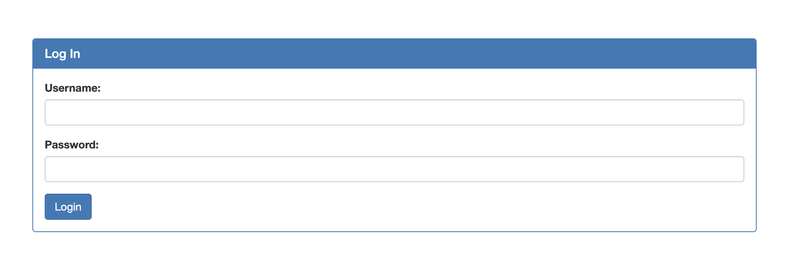
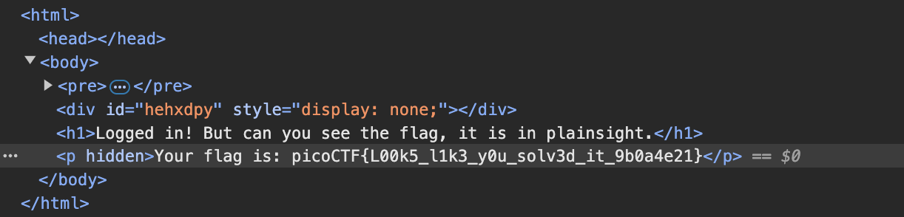

## 題目資訊

- 來源：picoCTF2024
- 分類：Web Exploitation
- 難度：中

## 解題流程

### 探勘

打開網頁，是個登入介面



題目已經說是 SQL Injection，先隨便輸入假資料後，會回傳內部的 SQL 語法


這是典型的 SQL Injection 題目，擋掉 password 就能直接登入

```text
' OR '1'='1
```


登入成功！但沒東西？！按一下 F12



## Flag

> picoCTF{L00k5_l1k3_y0u_solv3d_it_9b0a4e21}
